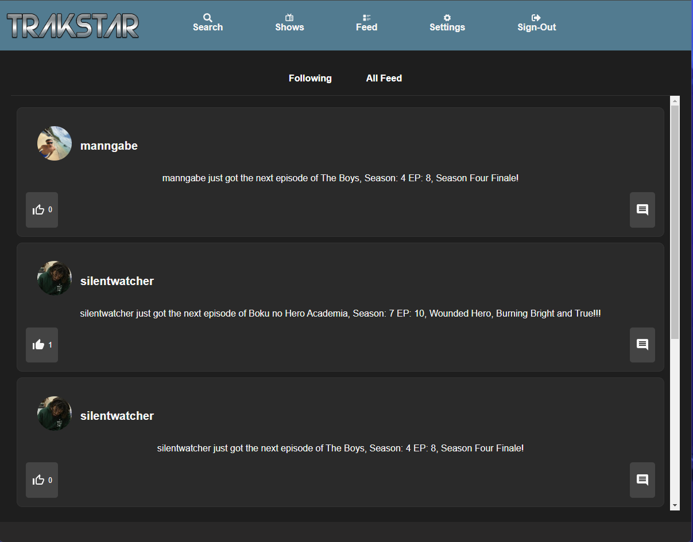
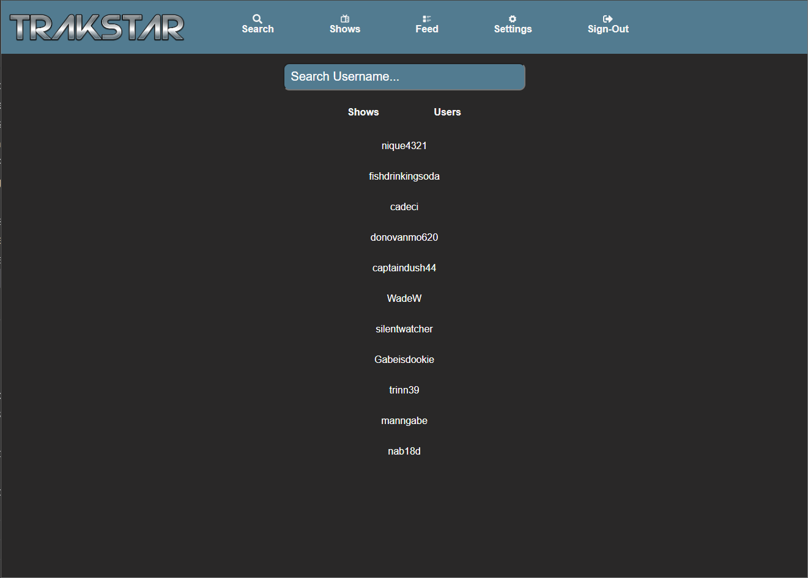
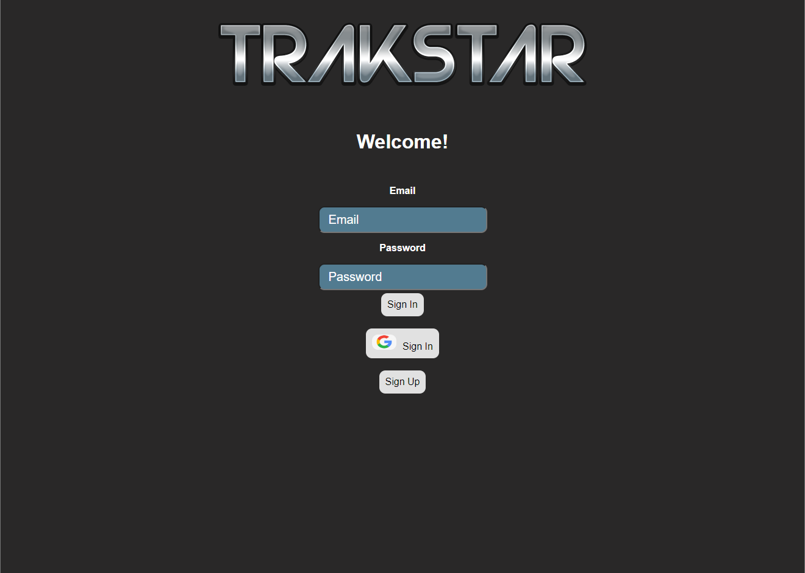
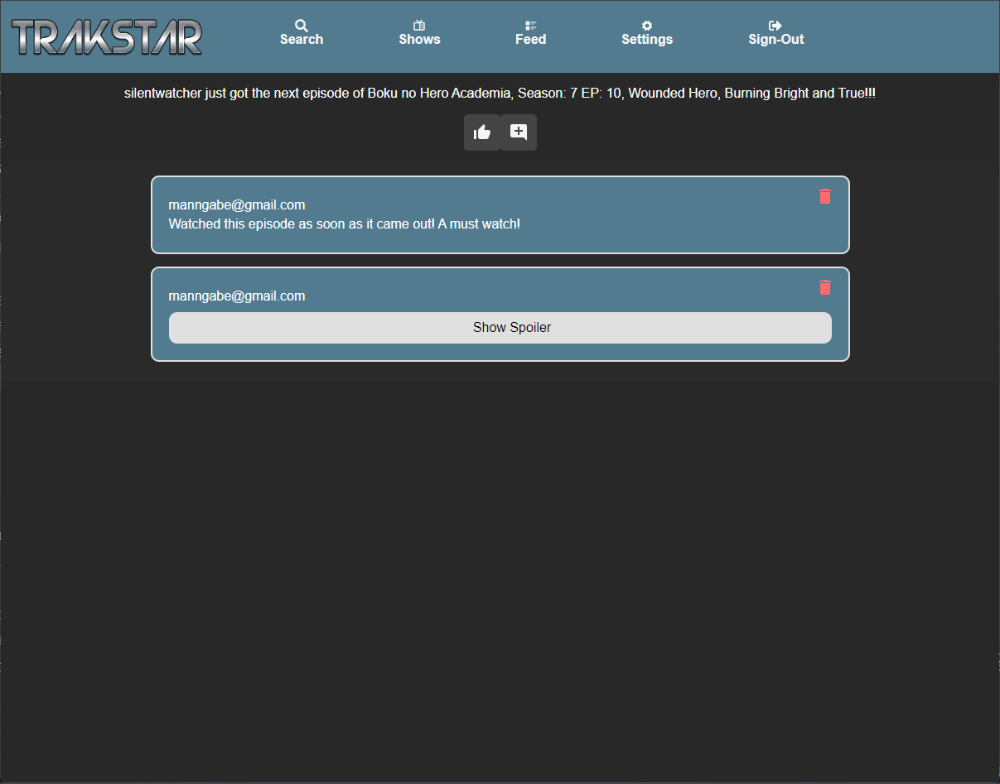
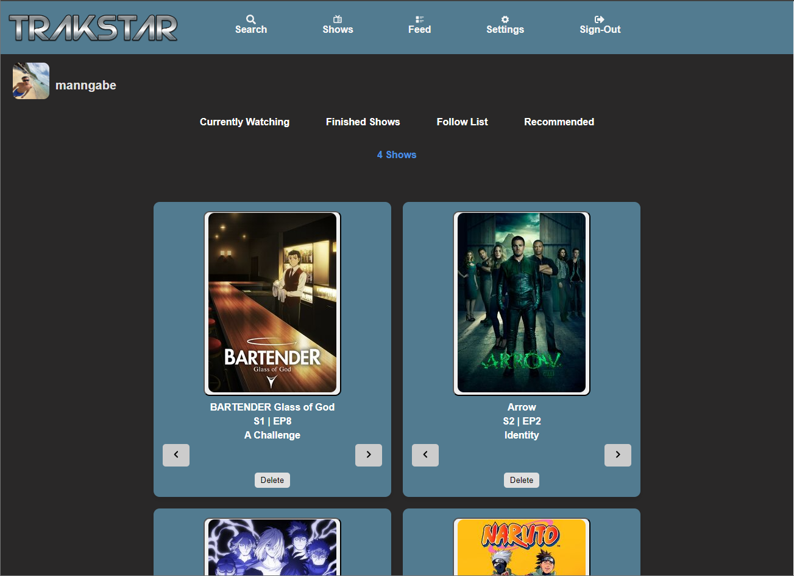
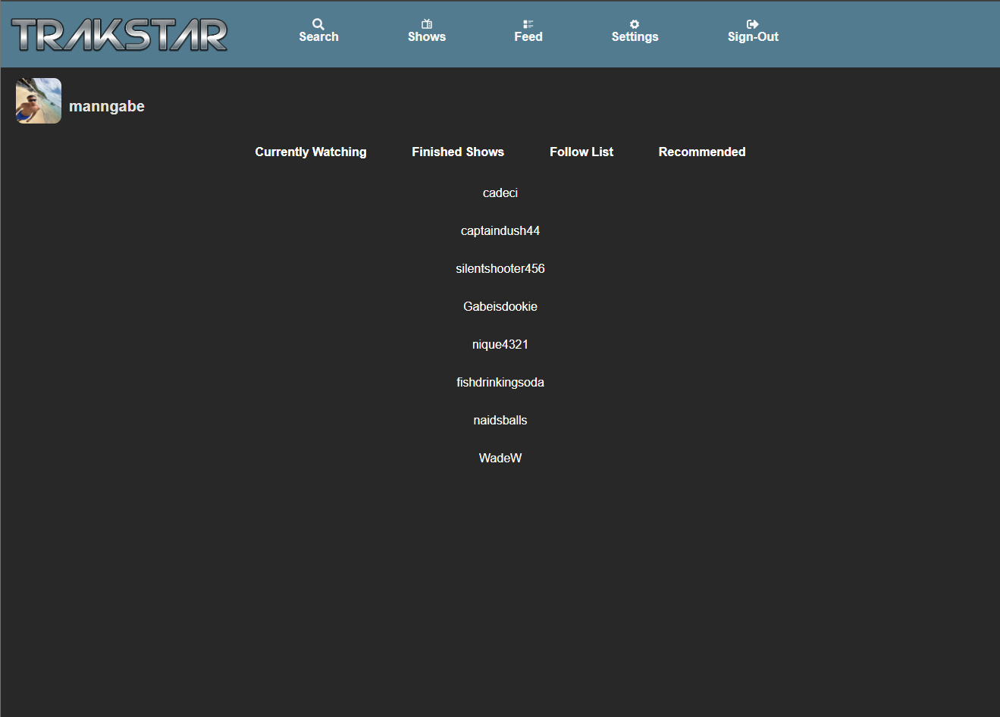
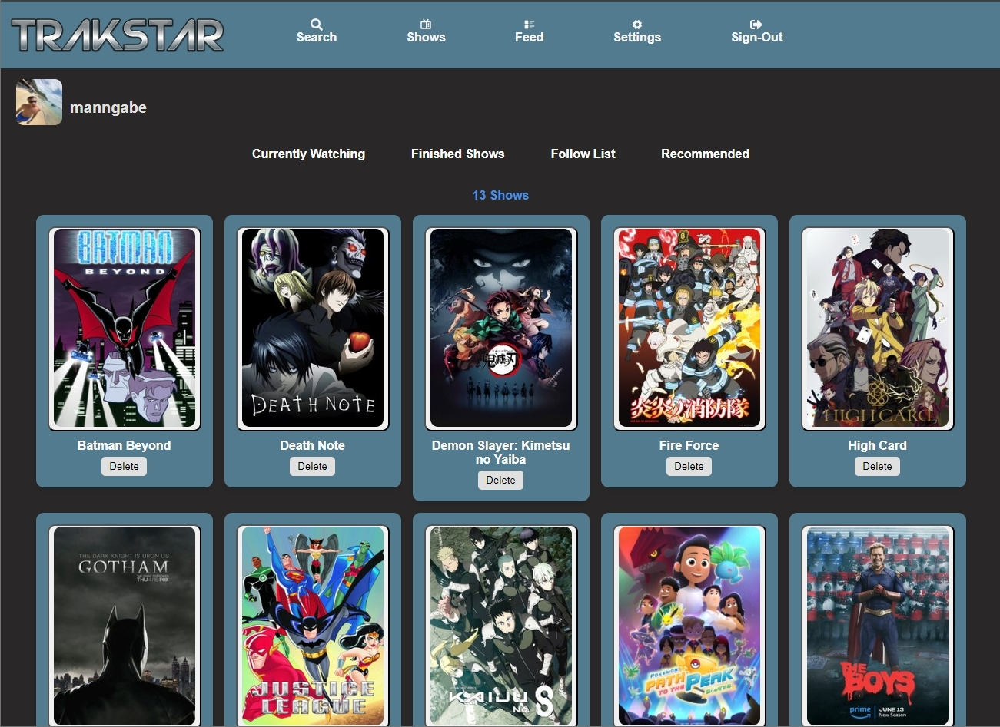

# TrakShow Ios App 📺

**Website:** [TrakShow](https://trakshow-final.netlify.app/)

  
  
  
  
  
  
  
  
  

# Features

### Login Screen Options

- **Login through username and password**
  - Implemented using Firebase Authentication, allowing users to securely log in with a username and password.
- **Login/Signup with Google**
  - Utilizes Firebase Authentication for seamless integration with Google Sign-In, providing a quick and easy login/signup process.
- **Sign up with email and password**
  - New users can register using their email address and a password, facilitated by Firebase Authentication.

  

### Show List

- **Pulls info from [Episodate API](https://www.episodate.com/api) on app launch**
  - Retrieves and displays the latest show information from the Episodate API every time the app is launched.
- **Select a show and see details**

  - Users can select a show to view detailed information, including the show’s name, rating, and description.
  - Users can also leave a rating and a review for the selected show and see what other have reviewed

  

  
  

### Show Screen

- **Name**
  - Displays the name of the selected show.
- **Rating**
  - Shows the current rating of the show.
- **Description of show**
  - Provides a detailed description of the show’s plot and characters.
- **Using Firebase to keep track of current episode**
  - Keeps track of the user's current episode using Firebase Firestore.
- **Add show to your list of shows**

  - Users can add shows to their personal list for easy access and tracking.

  

  

  

- User Screen

  - See your list of your shows
  - See who you follow

    

  
  
  

  

